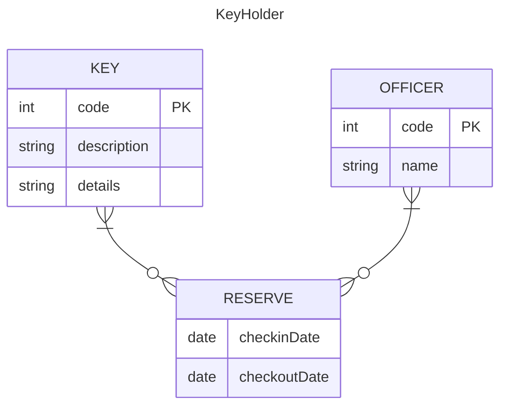

# KeyHolder

```mermaid
---
title: KeyHolder
---
erDiagram
    KEY |{--o{ RESERVE : ""
    KEY {
        int code PK
        string description
        string details

    }
    OFFICER |{--o{ RESERVE : ""
    OFFICER {
        int code PK
        string name 
    }
    RESERVE {
        date checkinDate
        date checkoutDate
    }


```